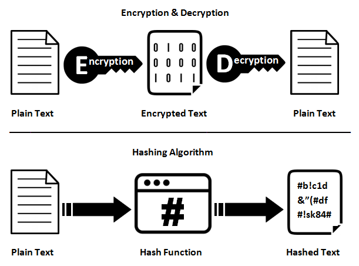

# 微信使用的技术

## 基本的用户识别技术（基于Token的识别)

Token是另一种Session。

1. appId： 帐号
2. appSecret： 密码
3. AccessToken: Session ID

特点：

1、不基于Cookie，可以防止基于Cookie的攻击（CSRF）

2、不需要浏览器的支持

3、适合服务器间通讯

## 基本的安全知识介绍

### 信息加密技术

#### 一、哈希（hash）

要求的规则：

1. 结果唯一
2. 无法逆向推导
3. 不同的输入，得到不同的输出

使用场景：

1. 大数据文件块的比较，比如几十G的数据比较是不是相同
2. 加速检索
3. 数据签名
4. 地理定位

常用的HASH算法：

1. MD（Message-Digest Algorithm）
  MD4,MD5

2. SHA（Secure Hash Algorithm）
  SHA1, SHA2

#### 二、加密

1. 对称加密：AES

只有一个key, 加密与解密使用相同的key

2. 非对称加密： RSA

有两个key，分别叫public key, private key。

public key用于加密，
private key 用于解密。

3. 混合加密

同时采用对称与非对称加密，增加了安全性

#### 三、比较Hash与加密

